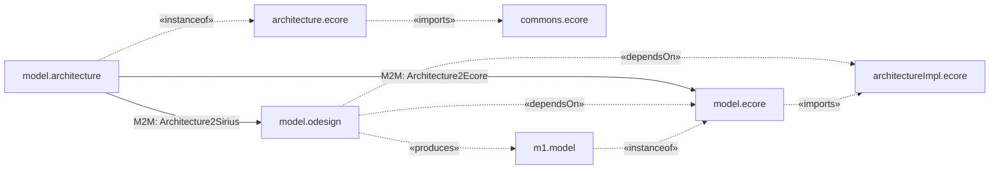

# Commons Metamodel

This repository contains a collection of Ecore Modeling projects for the [Sirius metaeditor](https://github.com/tuiSSE/sirius-meta-editor).

## UML diagrams

You can see the following mermaid code as a diagram with [this](https://github.com/BackMarket/github-mermaid-extension) browser extension

## Usage

1. Import all metamodel projects in [Eclipse Modeling Tools](https://www.eclipse.org/downloads/packages) with additionally [Eclipse Sirius](https://www.eclipse.org/sirius) installed
2. You can right-click on one of these project and select `Run As` -> `Eclipse Application`
3. The metamodel will be accessible in the new Eclipse instance with their respective URIs (for example) `http://e4sm-projekt.de/ecore/com` and Modeling Projects with `.architecture` models can be created in the new Eclipse instance.

### URIs

| Metamodel | URI |
|-|-|
|Architecture (aka DomainDescription) | http://e4sm-projekt.de/ecore/ar |
|ArchitectureImpl (aka DomainImpl) | http://e4sm-projekt.de/ecore/ari |
|Commons | http://e4sm-projekt.de/ecore/com |
|ExternalLib | http://e4sm-projekt.de/ecore/el |
